# 📚 WordWave – E-Library System

**WordWave** is an Android-based e-library application that allows users to borrow and read books digitally for a specific time period after payment.  
It helps eliminate the hassle of carrying physical books while offering an affordable and convenient reading experience.

---

## 🚀 Overview

WordWave makes reading accessible anytime and anywhere.  
Users can explore a wide range of books, make secure payments, and borrow them directly from the app.  
Built using **Kotlin**, **XML**, and **SQLite**, the app ensures smooth performance and a user-friendly interface.

---

## 🧩 Key Features

- 🔐 **Login & Registration** – Secure user authentication and easy sign-up.  
- 🏠 **Home Page** – Displays available and featured books.  
- 📖 **Book Details** – View detailed information before borrowing.  
- 💳 **Payment Integration** – Pay easily to borrow books for a limited time.  
- 📚 **My Books** – Track all borrowed books and remaining time.  
- 👤 **Profile Management** – Edit personal details and view history.  
- 📄 **PDF Viewer** – Read borrowed books directly inside the app.  
- ℹ️ **About Us & FAQ** – Learn about the app and find answers quickly.

---

## 🛠️ Tech Stack

- **Language:** Kotlin  
- **UI Design:** XML Layouts  
- **Database:** SQLite  
- **IDE:** Android Studio  
- **Build System:** Gradle  

---


## ⚙️ Setup & Installation

1. Clone the repository  
   ```bash
   git clone https://github.com/yashitaliya/WordWave.git
   ```

2. Open the project in **Android Studio**  
3. Wait for Gradle to sync automatically  
4. Connect an Android device or use an emulator  
5. Run the app to start exploring WordWave  

---

## 🖼️ Screenshots

Here’s a quick look at the main screens of **WordWave** showcasing its features and smooth flow.

| Login | Sign Up | Home |
|-------|----------|------|
| 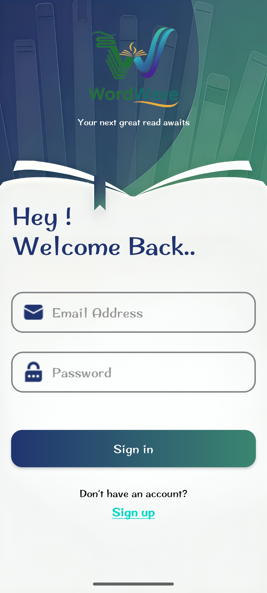 | 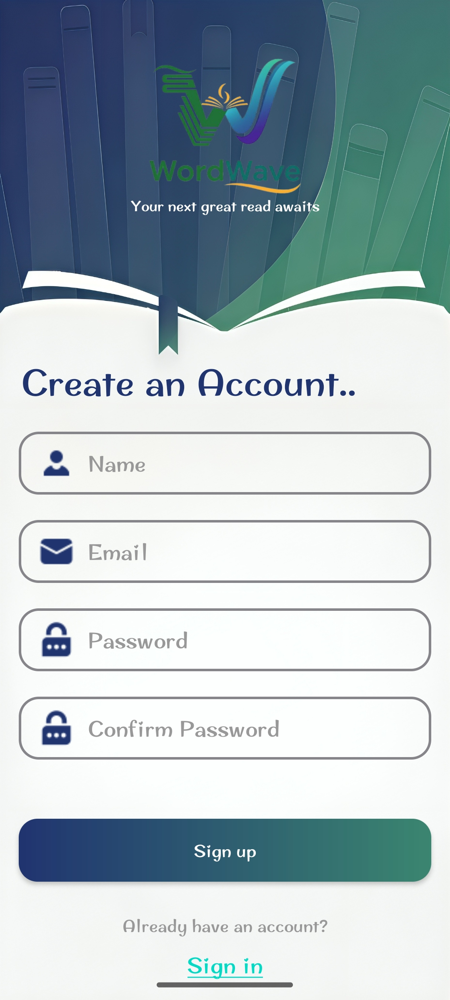 | 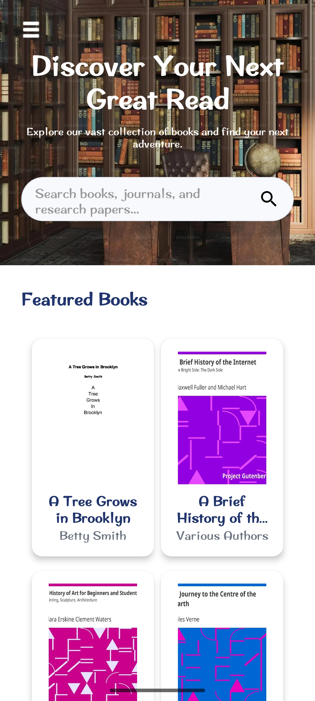 |

| Book Details | Payment | Profile |
|---------------|----------|----------|
| 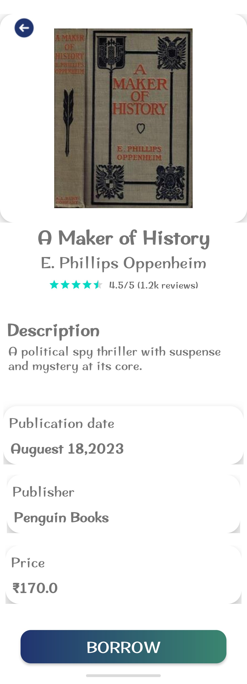 | 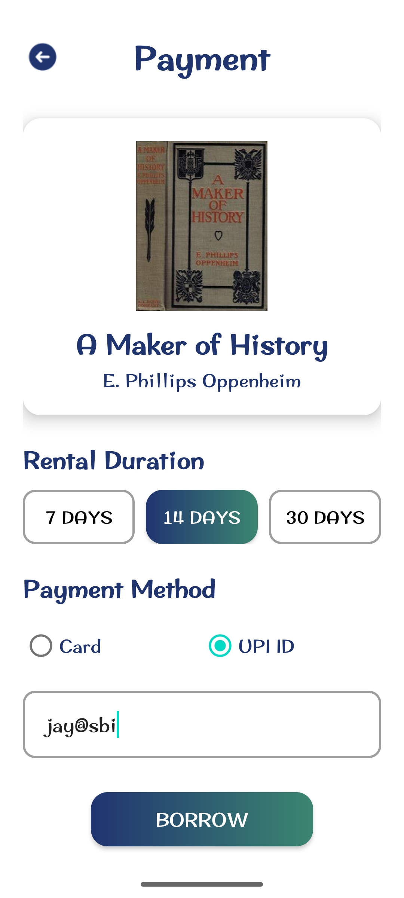 | 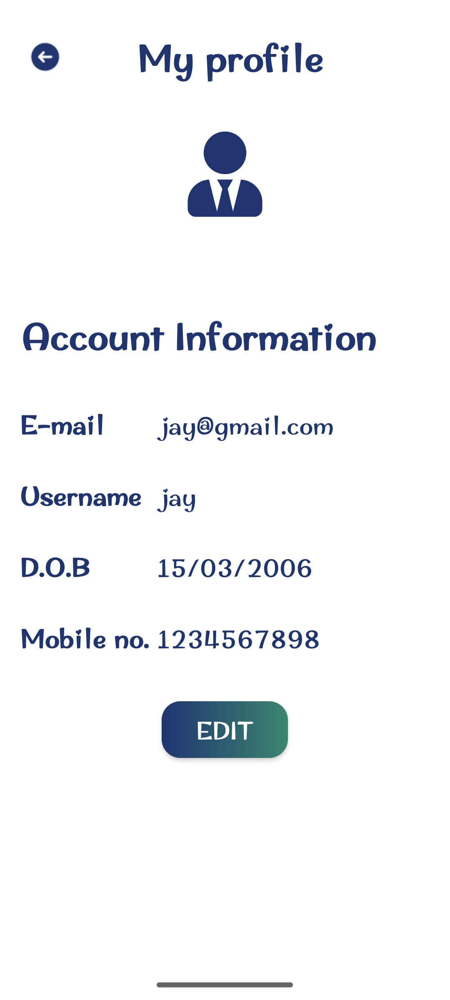 |

| Edit Profile | Purchased Books | Search |
|---------------|-----------------|---------|
| 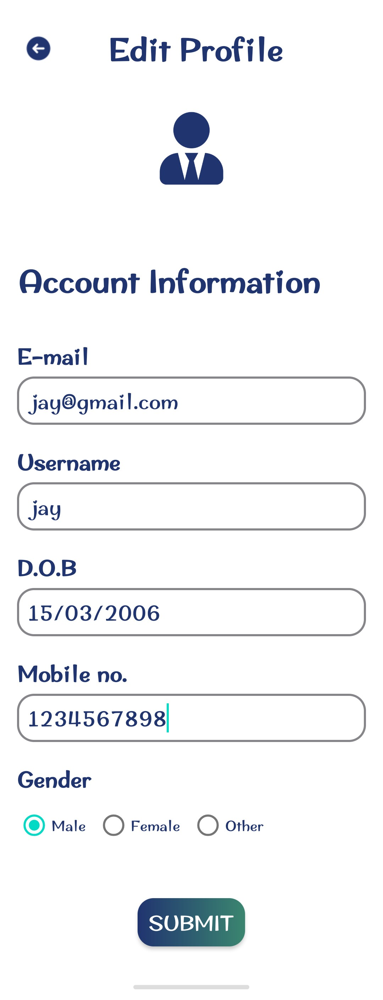 | 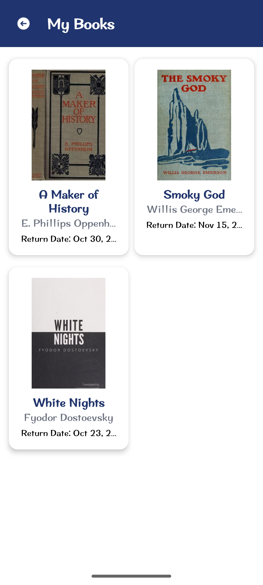 | 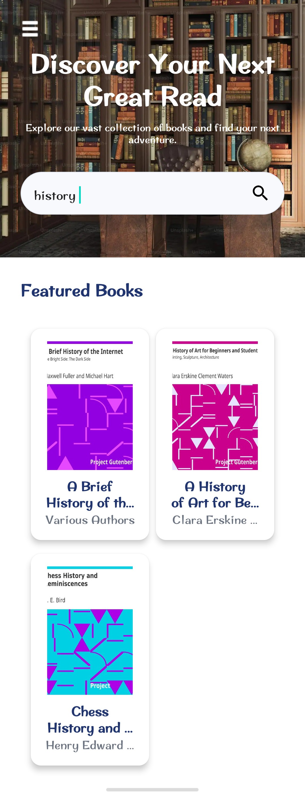 |

| Read Book | About Us | FAQ |
|------------|-----------|------|
| 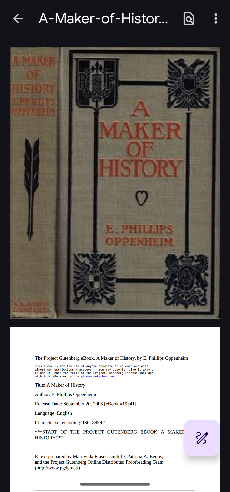 | 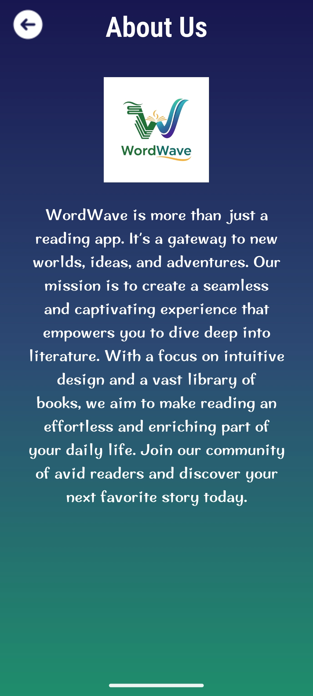 | 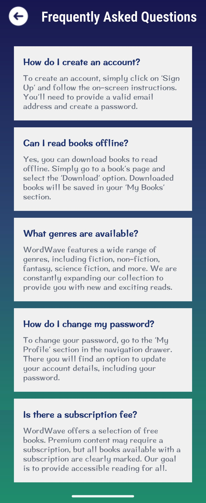 |

---

## 🔮 Future Improvements

* Cloud integration using Firebase  
* Due-date notifications   
* Enhanced filter options  

---

## 👩‍💻 Developers

This project was built collaboratively by a team of three developers who worked together on all parts of the app — from design and coding to testing and documentation.  
Every member contributed equally to ensure a smooth and complete project.

| Name | Role | Contact |
|------|------|----------|
| YASH ITALIYA | Developer | [GitHub](https://github.com/yashitaliya) |
| VEDANT JOSHI| Developer | [GitHub](https://github.com/vedantpjoshi) |
| YUG KALATHIYA | Developer | [GitHub](https://github.com/Yugkalathiya) |

  
