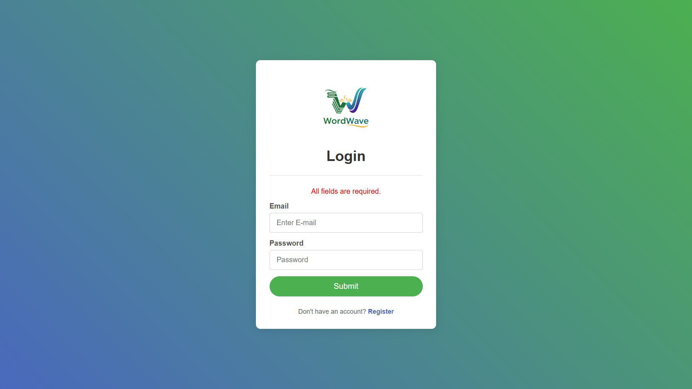
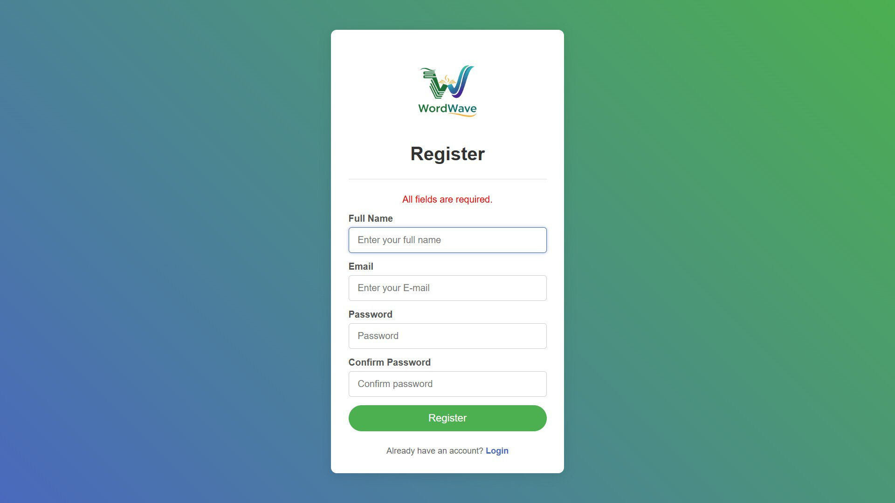
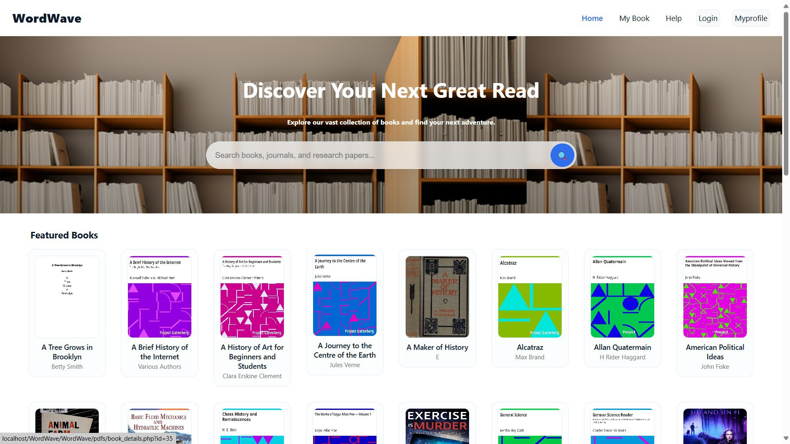
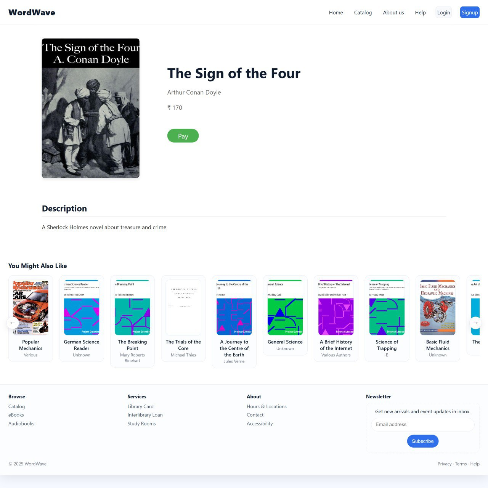
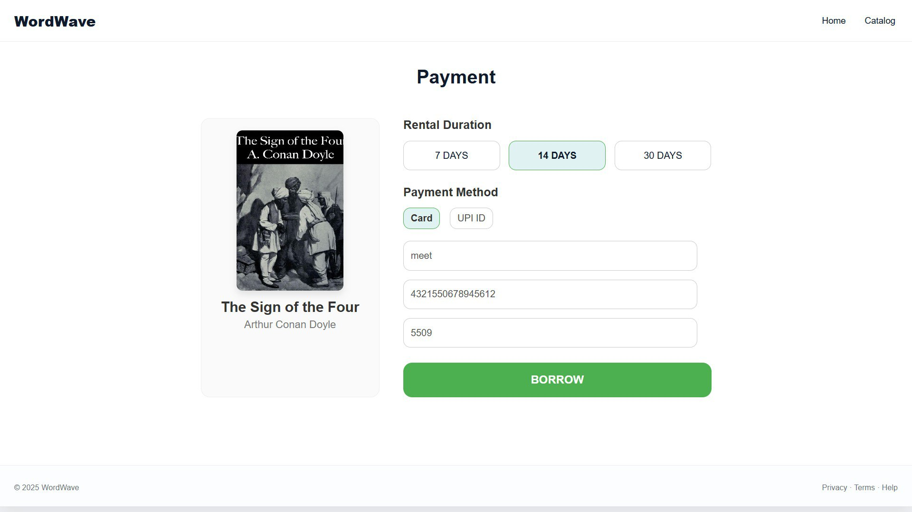
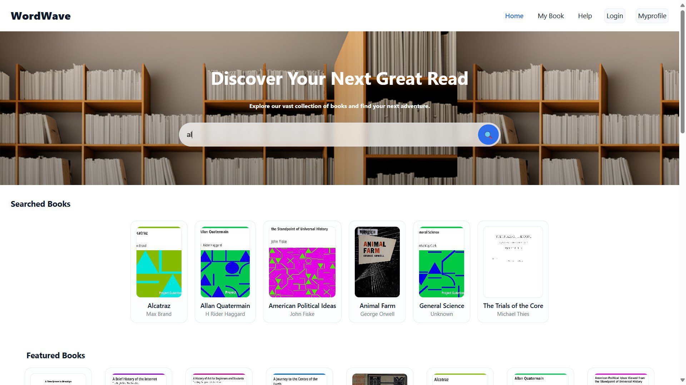
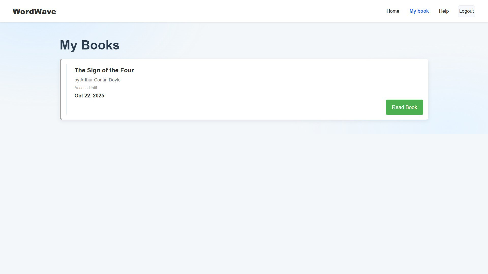
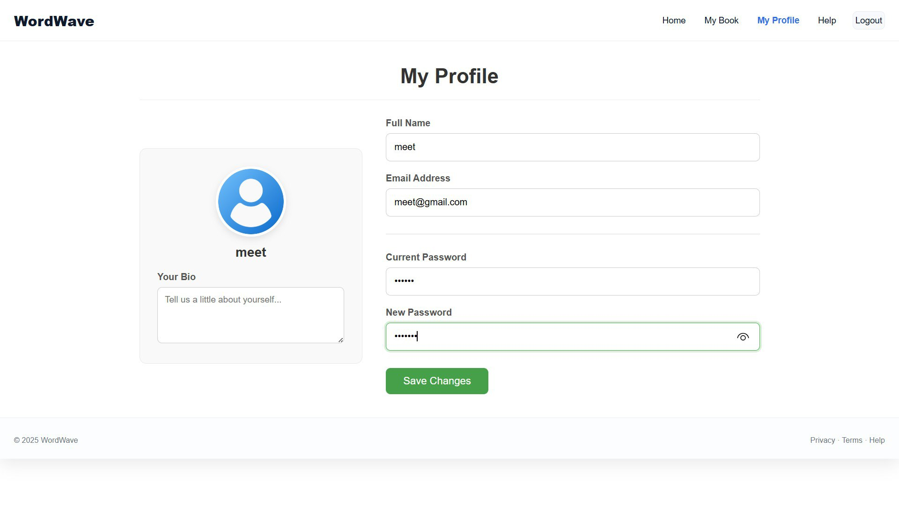

# 📚 WordWave – E-Library System

**WordWave** is a browser-based e-library platform that allows users to borrow and read books digitally for a specific time period after payment.  
It provides a seamless reading experience through any modern web browser, making books accessible anywhere with internet connectivity.

---

## 🚀 Overview

WordWave Web makes reading accessible anytime and anywhere through your web browser.  
Users can explore a wide range of books, make secure payments, and access them directly from the website.  
Built using **PHP**, **MySQL**, and modern **CSS**, the platform ensures reliable performance and a responsive user experience.

---

## 🧩 Key Features

- 🔐 **Login & Registration** – Secure user authentication and easy sign-up.  
- 🏠 **Home Page** – Displays available and featured books.  
- 📖 **Book Details** – View detailed information before borrowing.  
- 💳 **Payment Integration** – Pay easily to borrow books for a limited time.  
- 📚 **My Books** – Track all borrowed books and remaining time.  
- 👤 **Profile Management** – Edit personal details and view history.  
- 📄 **Online Reader** – Read borrowed books directly in your browser.  
---

## 🛠️ Tech Stack

- **Backend:** PHP
- **Frontend:** HTML5, CSS3, JavaScript
- **Database:** MySQL
- **Server:** Apache
- **IDE:** VS Code
- **Version Control:** Git
  

## ⚙️ Setup & Installation

1. Clone the repository
   ```bash
   git clone https://github.com/yashitaliya/WordWave.git
   ```

2. Set up local web server (XAMPP/WAMP/MAMP)
3. Import database schema
4. Configure database connection in `db.php`
5. Access through web browser

---

## 🖼️ Screenshots

### 🔐 Login Page


### 📝 Sign Up Page


### 🏠 Home Page


### 📚 Book Detail Page


### 💳 Payment Page


### 📖 Read Books Page


### 🔍 Search Page


### 📘 Borrowed Books Page


### 👤 Profile Page


---

## 🔐 Database Configuration

1. Update `db.php` with your credentials:
   ```php
   $host = "localhost";
   $username = "your_username";
   $password = "your_password";
   $database = "wordwave_db";
   ```

---

## 🔮 Future Improvements

* Integration with mobile app
* Enhanced payment options
* Advanced search filters
* Reading progress tracking
* Social sharing features

---

## 👩‍💻 Developers

This project was built collaboratively by three developers who worked together on all aspects of the web application — from UI and coding to testing and documentation.  
Every member contributed equally to the project’s success.

| Name            | Role      | Contact                                 |
|-----------------|-----------|-----------------------------------------|
| YASH ITALIYA    | Developer | [GitHub](https://github.com/yashitaliya) |
| VEDANT JOSHI    | Developer | [GitHub](https://github.com/vedantpjoshi) |
| YUG KALATHIYA   | Developer | [GitHub](https://github.com/Yugkalathiya) |
